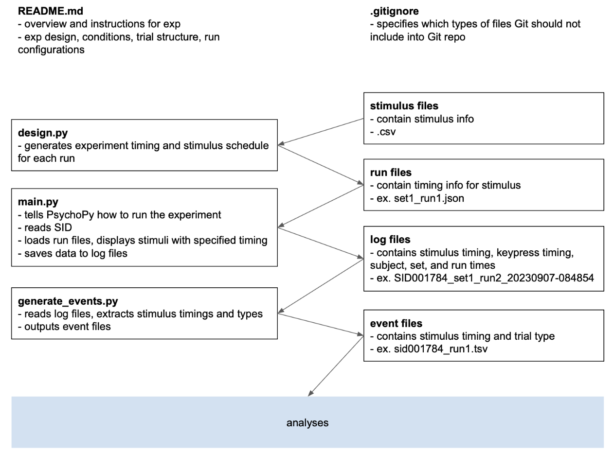

# HFHF project
hemiface hemifield project

Present left or right half faces in the left or right visual field. Participants make a decision on the sex of the half face.

## Design
The four conditions are:
- LFLV left half face in left visual field
- RFLV right half face in left visual field
- LFRV left half face in right visual field
- RFRV right half face in right visual field.

Each trial is on for _s and off for _s. Each block contains _trials. 
There are _ blocks per run. There is a _s blank after each block. 
Each run lasts _s. _s per run * _ runs = _min.

The participant presses a button when they see the fixation cue change color.

## Credits
7/30/2024 by Elizabeth Li
Thanks to Xiaoxuan Fan

## How to set up fMRI experiment files
